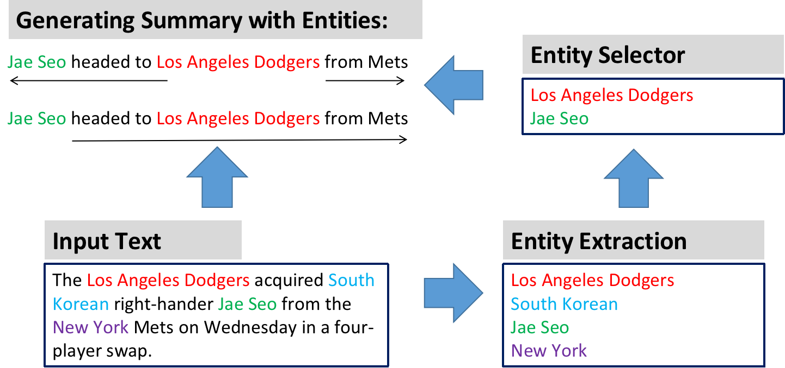

# Source code of Abs-LR Model for Abstractive Summarization with Guiding Entities
Implementation of Our Paper "Controllable Abstractive Sentence Summarization with Guiding Entities" in COLING 2020.


## Requirements

* `tensorflow > 2.1.0`
* `tqdm`
* `pyrouge`
* `numpy`
* `nltk`


## Model Architecture



Our controllable neural model with guiding entities. The original article texts are encoded with a BiLSTM layer. We utilize a pretrained BERT named entity recognition tool to extract entities from input texts. The decoder consists of two LSTMs: LSTM-L and LSTM-R. Our model starts generating the left and right part of a summary with selected entities and can guarantee that entities appear in final output summaries.


## Usage

Set parameter and path in `config.py`

Tokenize with `tokenizer.py`

Train the model with `train.py`


## Citation
If you find this repo helpful, please cite the following:

```
@inproceedings{zheng2020controllable,
  title={Controllable Abstractive Sentence Summarization with Guiding Entities},
  author={Zheng, Changmeng and Cai, Yi and Zhang, Guanjie and Li, Qing},
  booktitle={Proceedings of the 28th International Conference on Computational Linguistics},
  pages={5668--5678},
  year={2020}
}
```
